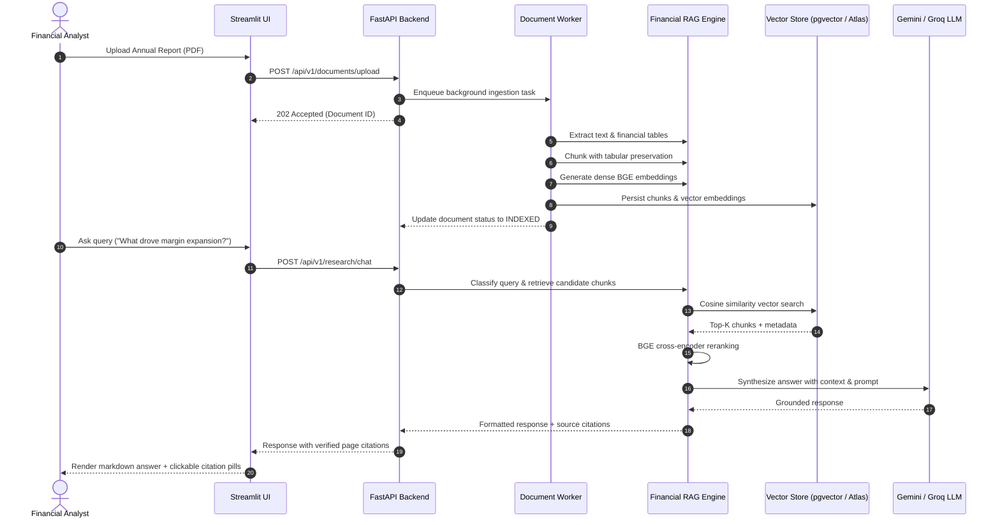

# ALPHANEXUS – End-to-End Data Flow

```mermaid
sequenceDiagram
    autonumber
    actor Analyst as Financial Analyst
    participant Frontend as Streamlit UI
    participant API as FastAPI Backend
    participant Worker as Document Worker
    participant RAG as Financial RAG Engine
    participant Store as Vector Store (pgvector / Atlas)
    participant LLM as Gemini / Groq LLM

    Analyst->>Frontend: Upload Annual Report (PDF)
    Frontend->>API: POST /api/v1/documents/upload
    API->>Worker: Enqueue background ingestion task
    API-->>Frontend: 202 Accepted (Document ID)

    Worker->>RAG: Extract text & financial tables
    Worker->>RAG: Chunk with tabular preservation
    Worker->>RAG: Generate dense BGE embeddings
    Worker->>Store: Persist chunks & vector embeddings
    Worker-->>API: Update document status to INDEXED

    Analyst->>Frontend: Ask query ("What drove margin expansion?")
    Frontend->>API: POST /api/v1/research/chat
    API->>RAG: Classify query & retrieve candidate chunks
    RAG->>Store: Cosine similarity vector search
    Store-->>RAG: Top-K chunks + metadata
    RAG->>RAG: BGE cross-encoder reranking
    RAG->>LLM: Synthesize answer with context & prompt
    LLM-->>RAG: Grounded response
    RAG-->>API: Formatted response + source citations
    API-->>Frontend: Response with verified page citations
    Frontend-->>Analyst: Render markdown answer + clickable citation pills
```
